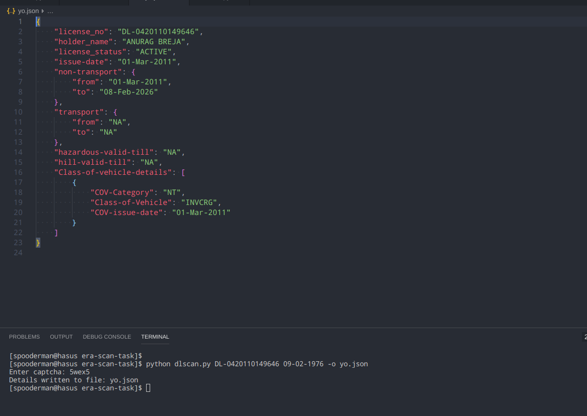

# dlscan

Python script to extract driving license info from [website](https://parivahan.gov.in/rcdlstatus/?pur_cd=101) of Ministry of Road Transport.

__Usage:__ `python dlscan.py [-h] [-o OUTPUT_FILE] dl_no dob`

> 'dl_no' is Driving license number  
> 'dob' is Date of birth

Positional arguments:   
* dl_no :  Driving license number you want to use   
* dob   :                Date of birth for driving license

Optional arguments:
* -h, --help      :      show this help message and exit
*  -o OUTPUT_FILE, --output-file OUTPUT_FILE : Store the details in a file

### Example Usage
``` bash
python dlscan.py --help
python dlscan.py DL-0420110149646 09-02-1976
python dlscan.py DL-0420110149646 09-02-1976 -o output.json
python dlscan.py DL-0420110149646 09-02-1976 --output-file file.json
```
__Note:__ It will ask you to enter captcha manually by showing you the captcha image. When it asks, enter the captcha on terminal.

__Note:__ This uses python `pillow/PIL` library for displaying captcha on GUI. So ensure that `PIL` is installed. Run `pip install pillow`.


### Inserting custom `get_captcha()` function

To insert custom `get_captcha()` function, go to `dlinfo.py`. There in class `ExtractInfo` replace function `__getcaptcha` with your custom function.  
Make sure your custom function has exactly same name and signature as function written in the file. And your captcha function should return the actual captcha as string.  
It is assumed that this function will return correct captcha otherwise the script will show 'Details not found'.

### File Info
* The `dlscan.py` is the main entry file. It takes the command line arguments and gives the desired output, interacting with the `dlinfo.py` module.
* The `dlinfo.py`module downloads the website page, gets the captcha image and then submits the form to get the driving license details. After getting the driving license details it passes it to `dlparser.py` module.
* The `dlparser.py` module accepts the driving license detail XML and parses it to form the desired JSON.

### Screenshots



